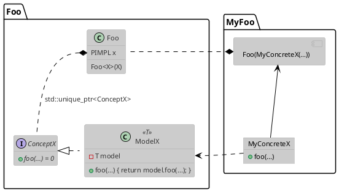
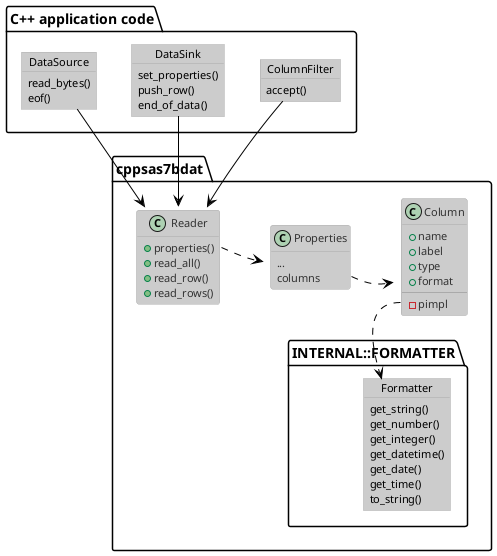

# cpp-sas7bdat

[](https://github.com/olivia76/cpp-sas7bdat/actions/workflows/build_cmake_ubuntu.yml)
[](https://github.com/olivia76/cpp-sas7bdat/actions/workflows/build_cmake_macos.yml)
[](https://github.com/olivia76/cpp-sas7bdat/actions/workflows/build_cmake_windows.yml)
[](https://codecov.io/gh/olivia76/cpp-sas7bdat)
[](https://github.com/olivia76/cpp-sas7bdat/actions/workflows/codeql-analysis.yml)


## Summary

This is a c++ 17 implementation of a SAS7BDAT file reader.  This project also provides a python and R interfaces.  

This is a toy project with cmake and C++ external polymorphism.

## What is a SAS7BDAT file?

A SAS7BDAT file is a database storage file created by Statistical
Analysis System (SAS) software. It contains a binary encoded dataset
used for advanced analytics, business intelligence, data management,
predictive analytics, and more. (from [fileinfo.com](https://fileinfo.com/extension/sas7bdat))

Different projects already exists to read SAS7BDAT files:

- https://github.com/topics/sas7bdat

This project is based on the following implementations:
- https://github.com/WizardMac/ReadStat/
- https://github.com/tk3369/SASLib.jl
- https://pypi.org/project/sas7bdat/

## C++ external polymorphism

This design pattern is very nicely explained in a talk of Klaus Iglberger - Breaking Dependencies: Type Erasure - A Design Analysis (https://www.youtube.com/watch?v=7GIz9SmRgyc)

The idea has been presented in September 1998 in "C++ Report" paper by Chris Cleeland and Douglas C. Schmidt introducing the external polymorphism pattern (https://www.dre.vanderbilt.edu/~schmidt/PDF/C++-EP.pdf).

> This pattern allows classes that are not related by inheritance and/or
have no virtual methods to be treated polymorphically.  This pattern combines C++ language features with patterns like Adapter and Decorator to give the appearance of polymorphic behavior on otherwise unrelated classes.

### Summary
A functionality `Foo` uses a concept `X` with different methods, i.e. `foo(...)`.  The concept `X` can be seen as an *interface* that a concrete *implementation* needs to fulfill.  The concrete implementation doesn't have to derive from the interface.  The link between the two is done via the *model* class.  Please note that this *model* class is called *adapter* in the original paper.

One of the main advantage of this pattern is the complete isolation of each the concrete implementations as they are not linked to a base class, see for example the talk of Sean Parent [inheritance is the base class of evil](https://www.youtube.com/watch?v=bIhUE5uUFOA).  They only have to expose a set of methods.




This pattern is used at different levels within this package:

- data source
- dataset sink
- selection/filtering of the dataset's columns
- dataset's column formatters


### Data source

A data source based on `std::ifstream` is provided in this package:
- [ifstream](include/cppsas7bdat/datasource_ifstream.hpp).

### Dataset sink

3 simple dataset sinks are provided in this package:
- [print](include/cppsas7bdat/datasink_print.hpp),
- [csv](include/cppsas7bdat/datasink_csv.hpp), and
- [null](include/cppsas7bdat/datasink_null.hpp).

The first one directly prints the content of the file (header and
data) to the screen and the second one is a very basic csv writer (no
field protection beside the double quotes, no encoding, ...).

### Column filtering

The package provides several filtering options:
- [ColumnFilter::AcceptAll](include/cppsas7bdat/column-filter.hpp)
- [ColumnFilter::Include](include/cppsas7bdat/column-filter.hpp)
- [ColumnFilter::Exclude](include/cppsas7bdat/column-filter.hpp)
- [ColumnFilter::IncludeExclude](include/cppsas7bdat/column-filter.hpp)

### Dataset's columns

Each column has a specific type and conversion/format operators.  The
external polymorphism is used internally to store the exact operator,
including endianness, 32/64 bits, ...

Supported types:
- string (`std::string`)
- integer (`long`)
- number (`double`)
- datetime (`boost::posix_time::ptime`)
- date (`boost::gregorian::date`)
- time (`boost::posix_time::time_duration`)

Each formatter [class](src/formatters.hpp) implements one or several *getters* as well as the *to_string* method.


## Relationship schema



## Usage

```c++
// See for example apps/cppsas7bdat-ci.cpp

#include <cppsas7bdat/sas7bdat.hpp>

struct MyDataSource {
	MyDataSource(...) { /* ... */ }

	/// This method is called to check if there is any more data
	bool eof() { /* ... */ }
	/// This method is called to read data
	bool read_bytes(void* _p, const size_t _length) { /* ... */ }
};

struct MyDataSink {
	MyDataSink(...) { /* ... */ }

	/// This method is called once the header/metadata is read.
	void set_properties(const cppsas7bdat::Properties& _properties) { /* ... */ }
	/// This method is called for each new row.
	void push_row(const size_t _irow, cppsas7bdat::Column::PBUF _p) { /* ... */ }
	/// This method is called at the end of data
	void end_of_data() { /* ... */ }
};

void read_sas7bdat(...)
{
	cppsas7bdat::Reader reader(MyDataSource(...), MyDataSink(...));

	// Read row by row
	while(reader.read_row());

	// OR Read chunk by chunk
	while(reader.read_rows(chunk_size));

	// OR read the whole file
	reader.read_all();
}

```

3 sinks -- `SinkByRow()`, `SinkByChunk(chunk_size)` and `SinkWholeData()` -- are provided by the
`pycppsas7bdat` python package.  They use `pandas.DataFrame` to store
the data.  


```python
from pycppsas7bdat.read_sas import read_sas

s = read_sas("filename.sas7bdat", include=[...], exclude=[...])
print(s.df)
```

```python
from pycppsas7bdat import Reader
from pycppsas7bdat.sink import SinkByRow, SinkByChunk, SinkWholeData

s = SinkByRow() # or SinkByChunk() or SinkWholeData()   
r = Reader("filename.sas7bdat", s, include=[...], exclude=[...])
# Read row by row
while r.read_row(): pass

# Read chunk by chunk
while r.read_rows(chunk_size): pass

# OR read the whole file
r.read_all()

# export to pandas.DataFrame
print(s.df)
```

It is easy to write your own sinks:

```python
class MySink(object):
    rows = []

    def set_properties(self, properties): # This method must be defined
		"""
		@brief: Called once after reading the header and metadata
		@param properties: A Properties object with the header, metadata and columns definition
		"""
        self.columns = [col.name for col in properties.metadata.columns]

    def push_row(self, irow, row): # This method must be defined
		"""
		@brief: Called for every row
		@param irow: Zero-based index of the row
		@param row: A list of value, one for each column.
		"""
        self.rows.append(row)

class MySinkChunk(object):
	chunks = []
	chunk_size = 10000   # This member must be present for a SinkChunk

	def set_properties(self, properties): # This method must be defined
        """
		@brief: Called once after reading the header and metadata
		@param properties: A Properties object with the header, metadata and columns definition
		"""
		self.columns = [col.name for col in properties.metadata.columns]

    def push_rows(self, istartrow, iendrow, rows): # This method must be defined
		"""
		@brief: Called for every read chunk of data
		@param istartrow: Zero-based index for the start row
		@param iendrow: Zero-based index for the end row (included)
		@param rows: A dict of list of values. The keys are the columns'names.
		"""
		chunks.append(rows)
```

```R
require(CPPSAS7BDAT)
library(R6)

sink <- CPPSAS7BDAT::read_sas("path/to/file.sas7bdat", include=c(...), exclude=c(...));

MySink <- R6Class("MySink",
     public=list(
        initialize = function() {
        },
        set_properties = function(properties) {
        },
        push_row = function(irow, row) {
        }
     )
);

MySinkChunk <- R6Class("MySinkChunk",
     public=list(
        chunk_size = NULL,
        initialize = function(chunk_size=10000) {
            self$chunk_size = chunk_size;
        },
        set_properties = function(properties) {
        },
        push_rows = function(istartrow, iendrow, rows) {
        }
     )
);

sink <- MySink$new(); # OR MySinkChunk$new(10000);
r <- CPPSAS7BDAT::sas_reader("path/to/file.sas7bdat", sink, include=c(...), exclude=c(...));
r$read_all(); OR r$read_row(); OR r$read_rows(chunk_size)
```

## Performance


| File | cppsas7bdat -- native *¹* | cppsas7bdat -- python *¹* | cppsas7bdat -- R *²* | SASLib.js *³* | readstat *¹* | pandas *¹* | sas7bdat -- python *¹* |
| :--------------------------------------- | :-------: | :------: | :------: | :--------: | :------: | :------: | :------: |
| data_AHS2013/topical.sas7bdat *ᵃ*        |  0.080 s  |  0.45 s  |   0.30s  |    1.1 s   |   1.8 s  |    11s   |   28 s   |
| data_misc/numeric_1000000_2.sas7bdat *ᵇ* |  0.013 s  |  0.21 s  |  0.02s  |   0.085 s  |   1.1 s  |   0.9s   |   5.5 s  |

> *¹* Measurements done with [hyperfine](https://github.com/sharkdp/hyperfine)  
> *²* Measurements done with rbenchmark  
> *³* Measurements done with Julia/BenchmarkTools  
> *ᵃ* 13M, 84355 rows x 114 cols  
> *ᵇ* 16M, 1000000 rows x 2 cols  

## Unit tests

The unit tests use more than 170 files from different
[sources](test/files.txt) with different encodings, compressions and
endianness.

## cmake

Inspired from https://github.com/cpp-best-practices/cpp_starter_project

## Conan

```bash
pip install conan
conan install conanfile.py
```

## boost

## Catch2
Catch2 needs to be installed in the system

```bash
git clone https://github.com/catchorg/Catch2 --branch v2.x
cd Catch2
mkdir build; cd build; cmake ..; make; sudo make install
```

## fmt
fmt needs to be install in the system

```bash
git clone https://github.com/fmtlib/fmt.git
cd fmt
mkdir build; cd build; cmake ..; make; sudo make install
```

## sdplog
spdlog needs to be install in the system

```bash
git clone https://github.com/gabime/spdlog.git
cd spdlog
cmake -S . -B ./build -DSPDLOG_FMT_EXTERNAL=ON; cmake --build ./build; cd build; sudo make install
```

## docopt

```bash
git clone git@github.com:docopt/docopt.cpp.git
cd docopt.cpp
mkdir build; cd build; cmake ..; make; sudo make install
```

## json

```bash
git clone git@github.com:nlohmann/json.git
cd json
mkdir build; cd build; cmake ..; make; sudo make install
```
